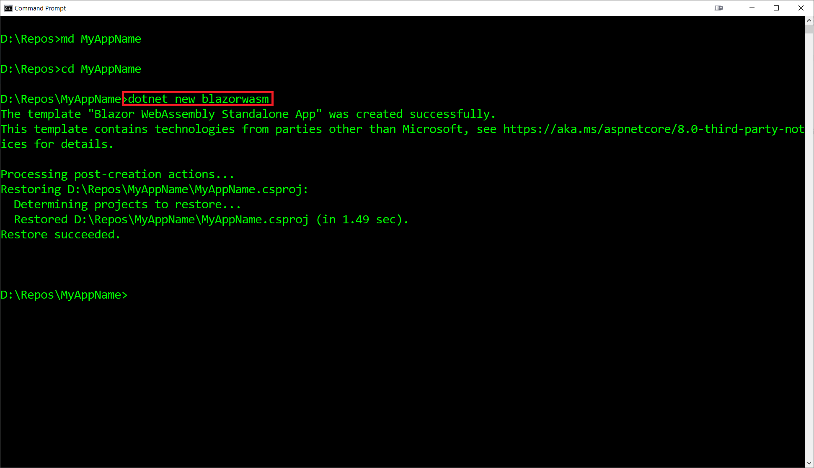

# Blazor Puzzle #24

## Let us Stand Alone

YouTube Video: [https://youtu.be/ulOD1qUhGZE](https://youtu.be/5T0WvX89FM4)

BlazorPuzzle Home Page: [https://blazorpuzzle.com](https://blazorpuzzle.com)

#### The Challenge:

How do you create a new .NET 8 WebAssembly Standalone project using Visual Studio?

You can't create one from the **Blazor Web App** template. Also, if you choose the **Blazor WebAssembly App Empty** you will not have the option to use .NET 8.

#### The Answer:

It turns out there is a template in Visual Studio called **Blazor WebAssembly Standalone App**

You can select all the options you had in .NET 7 including support for PWAs:

You can alternatively create a WebAssembly Standalone app using the dotnet CLI:

First navigate to the folder where you want the project to live, and then issue the following command:

`dotnet new blazorwasm`
